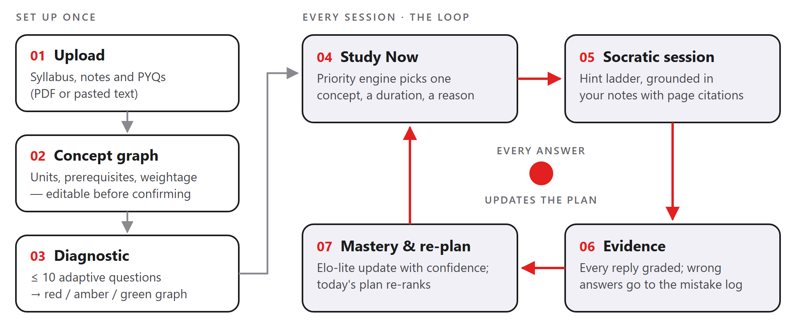

<!-- _class: lead -->
<!-- _paginate: false -->

# SyllabusOS

### Knows what you don't know. Teaches it without doing it for you.

Upload your syllabus, notes and previous-year papers. SyllabusOS finds your weak concepts, decides what to study next and **why**, then teaches it Socratically — and every answer updates the plan.

**Team Crazy Coders** · Horizon by Hoollow — Round 1 (Online MVP) · Theme: AI with Education

<!--
Speaker notes (≈20 s):
Open with the hook: "Every student has a syllabus, a deadline, and a chatbot that will do their homework for them. None of that makes them pass."
Then the one-liner on the slide. We are Team Crazy Coders; the categories are Education, Student Life and Productivity.
-->

---

# Students don't lack content. They lack **decisions**.

- **No prioritisation** — 30+ topics, no order, no weightage, no link to the exam date or free time
- **No self-knowledge** — "I read it" is not "I know it"; the gap shows up in the exam hall
- **Static plans die on day 2** — miss one session and the timetable becomes a backlog
- **AI makes it worse** — paste question → copy answer → feel competent → fail the offline exam. Chatbot "study modes" don't know your syllabus, deadline or past mistakes

> **Core insight:** the gap is not information, it is **execution** — knowing what to do next, and actually learning it instead of copying it.

<!--
Speaker notes (≈35 s):
Walk the four failure modes quickly. Stress the last one: general chatbots are answer engines, so students feel competent until the offline exam.
Land the core insight: we are not building more content, we are building the decision and the learning.
Target users: university students preparing for semester exams, starting with Indian universities where preparation is driven by previous-year questions (PYQs).
-->

---

# The solution: **one closed loop**



Set up once in minutes, then every study session runs the loop. **Every AI interaction must produce a visible change in the student's learning state.**

<!--
Speaker notes (≈40 s):
Left: set up once. The student sets subject, exam date and minutes per day, uploads the syllabus (it becomes an editable concept graph of 20–40 concepts with prerequisites), optionally adds PYQs, and takes a diagnostic of at most 10 adaptive questions. The graph turns red, amber and green.
Right: the loop. Study Now picks one concept, a duration and a reason. The Socratic session teaches it from the student's own notes. Every reply is graded into evidence, mastery updates, and the plan re-ranks.
-->

---

# What makes it **different**

| Differentiator | What it means |
|---|---|
| **1 · The decision engine is code, not vibes** | A deterministic, unit-tested priority engine picks what to study — the LLM never does. Every pick ships with a reason built from the real scores. |
| **2 · Socratic by default, every exchange measured** | Probe → hint → stronger hint → worked step → check. Each reply is graded correct / partial / wrong with a misconception, and feeds mastery. |
| **3 · Weightage from real PYQs** | Past papers are mapped to concepts, giving the real share of marks per topic. With no PYQs, the estimate is clearly labelled "estimated". |

> **Study Now →** Conflict Serializability · 25 min
> _High exam weightage (18% of PYQ marks) and it unlocks Recoverability._

<!--
Speaker notes (≈40 s):
Three differentiators, not seven.
1) Explainable and defensible: no hallucinated advice, because the recommendation comes from a pure function with tests.
2) Learning is the assessment: students can't shortcut to the answer; asking for it gets a guiding question until the worked step.
3) PYQ weightage is what Indian students immediately recognise: it focuses limited time on what the exam actually rewards.
Read the example card out loud; it is the "money shot" of the demo.
-->

---

# Under the hood: **decisions in code**, AI where it helps

```text
value(c)    = 0.30·Weightage + 0.30·Gap + 0.20·Unlock + 0.10·MistakeRate + 0.10·Decay
priority(c) = value(c) / √(minutes still needed)
```

- **Prerequisite gating** — prerequisite below 50%? Study that first: _"Blocked by Functional Dependency…"_
- **Elo-lite mastery per concept**, always shown with its confidence; quiz answers count 1.0, tutor replies 0.5
- **The deadline sets the mode** — Learn · Revision (≤ 3 days left) · Triage (drops low-weightage topics and says why)
- **AI layer** — Gemini via Vercel AI SDK, every output validated with Zod, a verify pass on generated questions, RAG with page citations, and an offline mode without an API key
- **Stack** — Next.js 16 · TypeScript · PostgreSQL + pgvector · Prisma 7 · Auth.js (guest demo login)

<!--
Speaker notes (≈45 s):
The priority formula is five normalised components; dividing by the square root of time needed means a quick, high-value topic beats a slow one.
Gating follows the prerequisite chain, so the student fixes the root cause first.
Mastery uses an Elo-style update: expected correctness is sigmoid(theta minus difficulty); early evidence moves it more. Confidence is always shown, so one lucky answer reads as "low confidence", not fact.
The deadline changes the mode instead of multiplying every score.
Architecture: one Next.js app, one Postgres with pgvector, one LLM provider. The engine has no DB, no LLM and no clock, so it is fully unit-testable.
-->

---

# Built, secured, and **what's next**

| Built and verified | Security hardening | Next |
|---|---|---|
| All 15 routes: onboarding, diagnostic, learn, graph, mistakes, plan, revision, settings | Rate limits on sign-up and every AI action, daily AI budget | Voice Socratic mode |
| Gemini with fallback models + full offline mode | Prompt-injection guard; model never trusted for ids or citations | Class heatmap for teachers |
| Retrieval over your notes with page citations | CSP + security headers, upload checks, IDOR checks | Hinglish and regional languages |
| 177 tests, CI, production build; phone and tablet layouts | Verified-email Google sign-in, 7-day guest expiry | Placement mode (JD → skills graph) |

> **We don't answer students' questions — we decide the next best thing for them to learn, explain why, and make sure they actually learn it.**

<!--
Speaker notes (≈35 s):
Everything in the loop is built and verified end to end in the browser, on desktop and on phones. A security audit found and closed abuse paths (unlimited guest accounts, AI cost abuse, prompt injection) before launch.
Roadmap for the offline round: voice Socratic mode using browser speech APIs, a teacher heatmap of class misconceptions, Hinglish explanations, and placement prep using the same loop.
Close on the one-liner, then invite judges to click "Try demo".
-->
